  
 <h1 align="center">Hi 👋, I'm Krushna Koshatwar</h1> <h3 align="center">🚀 Aspiring Backend & Full Stack Engineer | Java & JavaScript Developer</h3> 
<em>Building real-time applications and solving real-world problems through technology.</em>
 
    

<h2 align="center">👨‍💻 About Me</h2>

I'm a passionate Backend & Full Stack Developer focused on building scalable, real-time applications and solving real-world problems through technology.

💻 I work with Java, JavaScript, Node.js, Express.js, React, MongoDB, SQL and REST APIs
🧠 Continuously strengthening my DSA and system design skills
🌱 Currently exploring Docker, Kubernetes, Cloud Computing & CI/CD to build reliable, production-ready applications
🤝 Looking to contribute to impactful open-source projects
🚀 Learning and building across my repositories. Feel free to visit them and explore my work!
<h2 align="center">🛠️ Tech Stack</h2> 
 <b>Languages</b>      
 
 <b>Frontend</b>    
 
 <b>Backend & Databases</b>      
 
 <b>DevOps (learning)</b>    

<h2 align="center">📊 GitHub Stats</h2> 
   
 
  

<em>Thanks for stopping by. Let's build something great together. 🦊</em>

